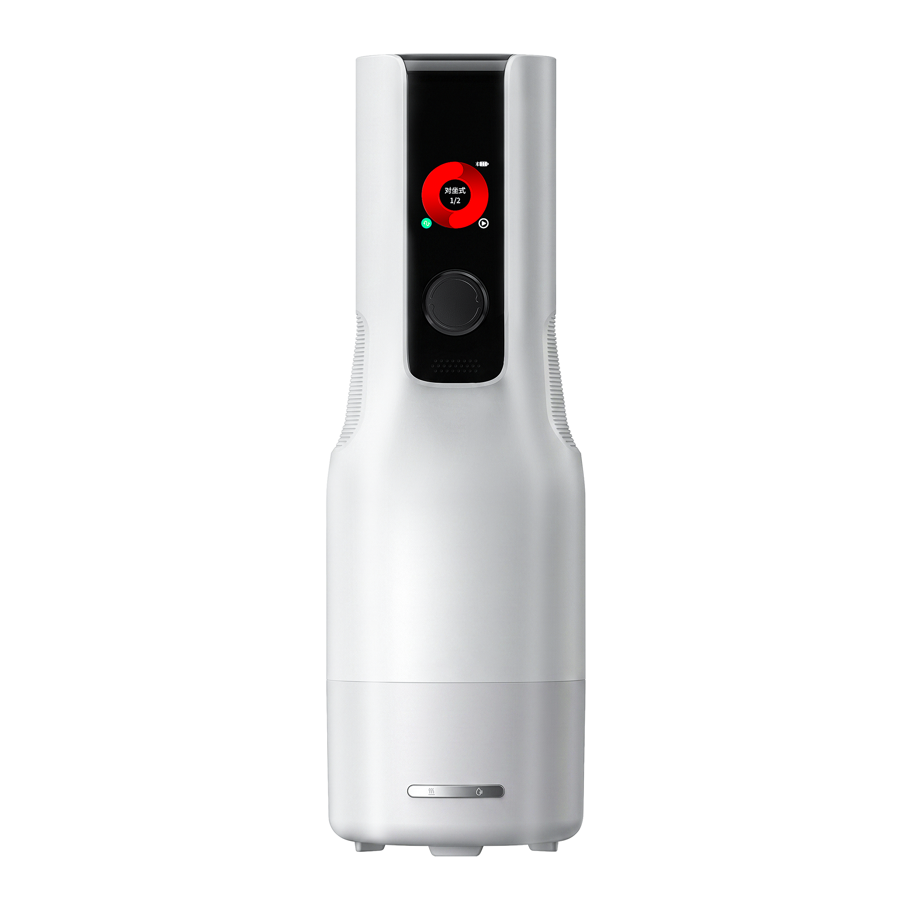
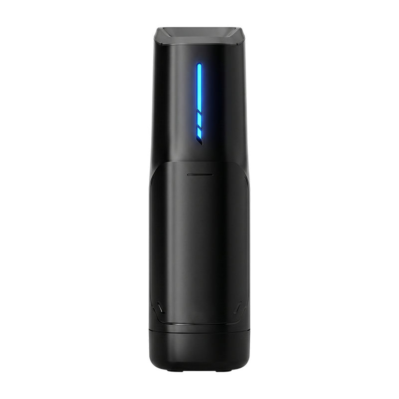

# MetaPact

可一键部署到 [openclaw](https://openclaw.ai) 的 agent 集合。每个子目录是一个独立的 agent pack，含人设 + skill + 安装器；通用文档在 `docs/`，各 agent 特色文档在 `docs/<agent-name>/`。

**适配设备：**[元力2][device-yuanli-2] / [黑洞SE][device-blackhole-se]，点击设备名可跳转到天猫旗舰店。

## 适配设备

MetaPact 当前适配以下设备，点击设备名可跳转到天猫旗舰店查看规格与购买：

| 图片 | 设备 | 说明 | 购买入口 |
|---|---|---|---|
|  | [元力2][device-yuanli-2] | 元力系列二代设备，适合作为 MetaPact 的主力接入硬件。 | [天猫旗舰店][device-yuanli-2] |
|  | [黑洞SE][device-blackhole-se] | 黑洞系列 SE 设备，适合偏好紧凑机身和入门配置的接入场景。 | [天猫旗舰店][device-blackhole-se] |

[device-yuanli-2]: https://detail.tmall.com/item.htm?id=1037817609223&mi_id=0000GTxq8HMe9_PPAPH1tY1x1oMKqLKCdeKp6namIWJ9IRQ&spm=a21xtw.29178619.0.0&xxc=shop
[device-blackhole-se]: https://detail.tmall.com/item.htm?id=1047577064356&mi_id=0000oFIIepmVf8WH_ZvYKGvTs2JM5LVDsepOoPar86Gg3A&spm=a21xtw.29178619.0.0&xxc=shop&skuId=6235813538860

## 一键安装

```bash
# 默认装 nako（目前唯一 agent），交互式问 cc-connect 接入
curl -fsSL https://cdn.jsdelivr.net/gh/Lovappen/MetaPact@main/install.sh | bash

# 非交互 + QR 飞书一气呵成
curl -fsSL https://cdn.jsdelivr.net/gh/Lovappen/MetaPact@main/install.sh | bash -s -- --with-feishu

# 选别的 agent
curl -fsSL https://cdn.jsdelivr.net/gh/Lovappen/MetaPact@main/install.sh | bash -s -- --agent <name>

# 看可用 agent
curl -fsSL https://cdn.jsdelivr.net/gh/Lovappen/MetaPact@main/install.sh | bash -s -- --list
```

完整 flag：`bash install.sh --help`。

## 现有 Agents

| Agent | 角色 | 渠道 |
|---|---|---|
| [nako](nako/) | 战斗女仆 野木奈子 | 飞书 / 微信 / Telegram / Slack /...（via [cc-connect](https://github.com/chenhg5/cc-connect)，微信视频优先用 [CodeEagle fork release](https://github.com/CodeEagle/cc-connect/releases/tag/v1.3.3)） |

## 文档

- [进阶玩法：Agent 通用自定义与调优](docs/advanced.md)
- [nako 文档](docs/nako/README.md)

## 与 agent 无关的工具

### `scripts/cc-connect-setup.sh` — 给任意 agent 做 cc-connect 多平台接入

也支持 curl 一键，参数走 `bash -s --` 传：

```bash
# 交互问要不要装飞书/微信
curl -fsSL https://cdn.jsdelivr.net/gh/Lovappen/MetaPact@main/scripts/cc-connect-setup.sh | bash

# 指定 agent + 自动 QR 飞书 + 微信
curl -fsSL https://cdn.jsdelivr.net/gh/Lovappen/MetaPact@main/scripts/cc-connect-setup.sh \
  | bash -s -- --agent-id agent-foo --with-feishu --with-weixin

# 本地 clone 后跑
bash scripts/cc-connect-setup.sh --agent-id agent-foo --with-feishu --with-weixin

# Hermes ACP 后端（Hermes 需已安装）
bash scripts/cc-connect-setup.sh --agent-id agent-foo --runtime hermes --with-feishu

# QClaw ACP 后端（QClaw 需已安装并已生成 ~/.qclaw/qclaw.json）
bash scripts/cc-connect-setup.sh --agent-id agent-foo --runtime qclaw --with-feishu

# 从 0 直接安装 Nako 到 QClaw（不要求 ~/.openclaw/openclaw.json）
bash install.sh --runtime qclaw --agent-id agent-nako --non-interactive

# 卸载某个 agent 的 cc-connect 接入
bash scripts/cc-connect-setup.sh --agent-id agent-foo --uninstall

# 一键完整卸载 cc-connect（配置会移到 ~/.cc-connect.bak-uninstall-all-*）
bash scripts/cc-connect-setup.sh --uninstall-all

# Windows PowerShell: 通过 QClaw 接入飞书/微信
pwsh install.ps1 -Runtime qclaw -WithFeishu -WithWeixin
```

QClaw 后端需要和 `cc-connect` 跑在同一个 host/user 下；如果 `cc-connect`
在 Linux VM 里，不能直接执行宿主机 macOS 的 `QClaw.app`。
接入后飞书/微信消息会写入 QClaw 的 `cc-connect 飞书/微信` ACP 会话，
对应 session key 为 `agent:<id>:session-cc-connect`。

完整 flag：`bash scripts/cc-connect-setup.sh --help`

### `scripts/nako-agent-factory/` — 局域网自助创建 Nako agent

给一台 host 部署 8088 管理页：每个客户端 IP 只分配一个 `agent-nako-N`，页面可选择 OpenClaw、Hermes 或 QClaw 作为消息后端，生成 / 刷新飞书和微信二维码，并直接展示安装与 QR 日志。

```bash
curl -fsSL https://cdn.jsdelivr.net/gh/Lovappen/MetaPact@main/scripts/nako-agent-factory/install.sh | sudo bash

# 或本地 clone 后跑
cd scripts/nako-agent-factory
sudo bash install.sh
```

打开 `http://<host-ip>:8088/` 后点击按钮即可创建或刷新当前 IP 对应的 agent。

## Roadmap

- [x] **多平台接入**：飞书原生 + 通过 [cc-connect](https://github.com/chenhg5/cc-connect) 接微信/Telegram/Slack/Discord/QQ/微博/钉钉/企微/LINE 等。详见 [`scripts/cc-connect-setup.sh`](scripts/cc-connect-setup.sh)
- [x] **一键 QR onboarding**：飞书 / 微信 ilink 都内置在安装脚本里
- [ ] **微信原生语音气泡**：iLink Bot API 协议级限制——`@tencent-weixin/openclaw-weixin` 不暴露 `sendVoiceMessageWeixin`，外部 bot 发 voice item 永远 `ret=-2`。等腾讯放开（[chenhg5/cc-connect#763](https://github.com/chenhg5/cc-connect/issues/763)）
- [ ] **微信 cron 主动推送**：`context_token` TTL 短，cron-driven daily-reminder 不保证送达。需要 cc-connect 实现 token 续期或换协议
- [ ] **MiniMax 国际版**（`api.minimax.io`）
- [ ] **更多 agent 模板**（办公助手、学习搭档…）
- [ ] **共享 skill 库**：把 `nako/skills/` 里通用的 vision/hearing/voice/selfie 提取到 root 让多 agent 复用

## 贡献

欢迎开 PR 加新 agent pack。格式参考 `nako/` 的目录结构：

```
your-agent/
├── install.sh           # 入口
├── install.ps1          # Windows
├── README.md            # 快装 + 定位
├── agent/               # 人设 md 文件 + custom.md 模板
├── skills/              # 本 agent 用到的 skill
├── config/
│   └── model-map.yaml   # 按能力的模型候选表
└── scripts/             # 安装器内部 helper

docs/
└── your-agent/          # 该 agent 的用户文档与特色玩法
```

新 pack 必须：
- 不把任何真实 key / secret 提交进仓库（`.env.*.example` 仅占位）
- 升级路径不破坏用户 `custom.md` / `memory/` / `sessions/`
- 有 `scripts/smoke-test.sh` 冒烟脚本
- 顶层 README 里加一行，并在 `docs/<agent-name>/` 放用户文档

## License

MIT, see [LICENSE](LICENSE).
